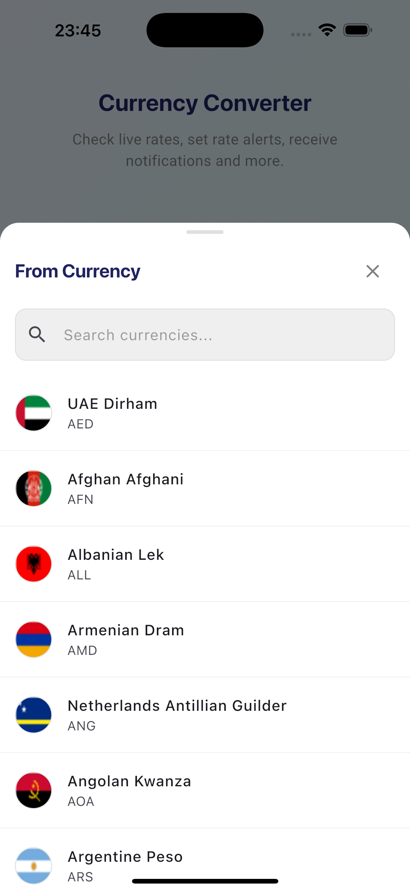

# 💰 CoinBox - Currency Converter App

A beautiful, modern currency converter app built with Flutter that provides real-time exchange rates and an intuitive user experience.

## 📱 Screenshots

### Main App States

#### Empty State

*Clean, minimal interface ready for currency conversion*

#### Selected State

*Currencies selected with beautiful flag displays*

#### Converted State

*Real-time conversion with exchange rate display*

#### Click to Reverse State

*Interactive swap functionality for easy currency reversal*

### Currency Selection

#### Bottom Sheet Loading State

*Beautiful skeleton loading animation while fetching currencies*

#### Bottom Sheet Loaded State

*Comprehensive currency list with search functionality*

## ✨ Features

### 🎨 **Modern UI/UX**
- **Beautiful Gradient Background**: Custom gradient design with smooth color transitions
- **Responsive Design**: Optimized for all screen sizes and orientations
- **Landscape Mode Support**: Fully optimized layout for both portrait and landscape orientations
- **Skeleton Loading**: Elegant loading animations using Skeletonizer
- **Smooth Animations**: Fluid transitions and micro-interactions

### 💱 **Currency Conversion**
- **Real-time Exchange Rates**: Live currency conversion with up-to-date rates
- **170+ Currencies**: Support for major world currencies
- **Currency Flags**: Visual currency identification with flag icons
- **Swap Functionality**: One-tap currency reversal

### 🔍 **Smart Search**
- **Instant Search**: Real-time currency filtering
- **Multiple Search Criteria**: Search by currency name or code
- **No Results Handling**: User-friendly empty state messages

### 🌍 **Internationalization**
- **Multi-language Support**: English and Spanish localization
- **Localized Error Messages**: User-friendly error handling
- **Cultural Adaptation**: Proper number formatting and currency symbols

### 🚀 **Performance**
- **Image Caching**: Optimized flag loading with cached network images
- **Memory Management**: Efficient resource usage
- **Fast Loading**: Preloaded common currency flags
- **Offline Support**: Graceful handling of network issues

## 🏗️ Architecture

### **Clean Architecture**
```
lib/
├── core/                    # Core functionality
│   ├── constants/          # App constants and colors
│   ├── errors/             # Error handling
│   ├── localization/       # Internationalization
│   ├── network/            # Network layer
│   ├── responsive/         # Responsive design utilities
│   ├── services/           # Core services
│   ├── theme/              # App theming
│   ├── utils/              # Utility functions
│   └── widgets/            # Reusable widgets
└── features/
    └── currency_converter/ # Currency converter feature
        ├── data/           # Data layer
        ├── domain/         # Business logic
        └── presentation/   # UI layer
```

### **State Management**
- **Riverpod**: Modern state management with providers
- **AsyncValue**: Proper handling of loading, error, and success states
- **Form Validation**: Real-time input validation with localized error messages

### **Dependencies**
- **flutter_riverpod**: State management
- **dio**: Advanced HTTP client for network requests
- **cached_network_image**: Image caching
- **skeletonizer**: Loading animations
- **responsive_framework**: Responsive design
- **equatable**: Value equality
- **intl**: Internationalization

## 🚀 Getting Started

### Prerequisites
- Flutter SDK (3.9.2 or higher)
- Dart SDK
- Android Studio / VS Code
- iOS Simulator / Android Emulator

### Installation

1. **Clone the repository**
   ```bash
   git clone https://github.com/yourusername/coinbox.git
   cd coinbox
   ```

2. **Install dependencies**
   ```bash
   flutter pub get
   ```

3. **Generate localization files**
   ```bash
   flutter gen-l10n
   ```

4. **Run the app**
   ```bash
   flutter run
   ```

## 🧪 Testing

The project includes comprehensive test coverage:

```bash
# Run all tests
flutter test

# Run specific test file
flutter test test/currency_converter_screen_test.dart

# Run tests with coverage
flutter test --coverage
```

### Test Coverage
- **Widget Tests**: UI component testing
- **Unit Tests**: Business logic validation
- **Integration Tests**: End-to-end functionality

## 🎨 Design System

### Colors
- **Primary Gradient**: `#EAEAFE` to `#DDF6F3`
- **Primary Header**: `#1F2261`
- **Background**: `#F6F6F6`
- **Text Colors**: Hierarchical text color system

### Typography
- **Google Fonts**: Modern, readable font family
- **Responsive Text**: Adaptive sizing for different screen sizes
- **Localized Fonts**: Proper font rendering for all languages

### Components
- **CurrencyFlag**: Cached network image with fallback
- **ExchangeRateDisplay**: Real-time rate display with error handling
- **CurrencyPickerModal**: Searchable currency selection
- **NetworkStatusWidget**: Connection status indicator

## 🌐 API Integration

### Exchange Rate API
- **Dio HTTP Client**: Advanced HTTP client with interceptors and error handling
- **Real-time Data**: Live currency exchange rates
- **Error Handling**: Graceful API failure management with Dio's built-in error handling
- **Caching**: Optimized data fetching and storage

### Currency Data
- **Static Data**: Local currency information
- **Dynamic Updates**: Real-time rate updates via Dio
- **Offline Support**: Cached data for offline usage

## 📱 Platform Support

- **iOS**: Full iOS support with native feel
- **Android**: Material Design implementation
- **Web**: Responsive web application
- **Desktop**: Cross-platform desktop support
- **Orientation Support**: Seamless experience in both portrait and landscape modes

## 🔧 Development

### Code Quality
- **Flutter Lints**: Strict linting rules
- **Clean Code**: Consistent code formatting
- **Documentation**: Comprehensive code documentation
- **Type Safety**: Full type safety with Dart

### Performance
- **Image Optimization**: Efficient flag loading
- **Memory Management**: Proper resource cleanup
- **Build Optimization**: Optimized app size and performance

## 🤝 Contributing

1. Fork the repository
2. Create a feature branch (`git checkout -b feature/amazing-feature`)
3. Commit your changes (`git commit -m 'Add amazing feature'`)
4. Push to the branch (`git push origin feature/amazing-feature`)
5. Open a Pull Request

## 📄 License

This project is licensed under the MIT License - see the [LICENSE](LICENSE) file for details.

## 🙏 Acknowledgments

- **Flutter Team**: For the amazing framework
- **Riverpod**: For excellent state management
- **Currency API Providers**: For real-time exchange rate data
- **Open Source Community**: For the amazing packages and tools

## 📞 Support

If you have any questions or need help, please:
- Open an issue on GitHub
- Contact the development team
- Check the documentation

---

**Made with ❤️ using Flutter**